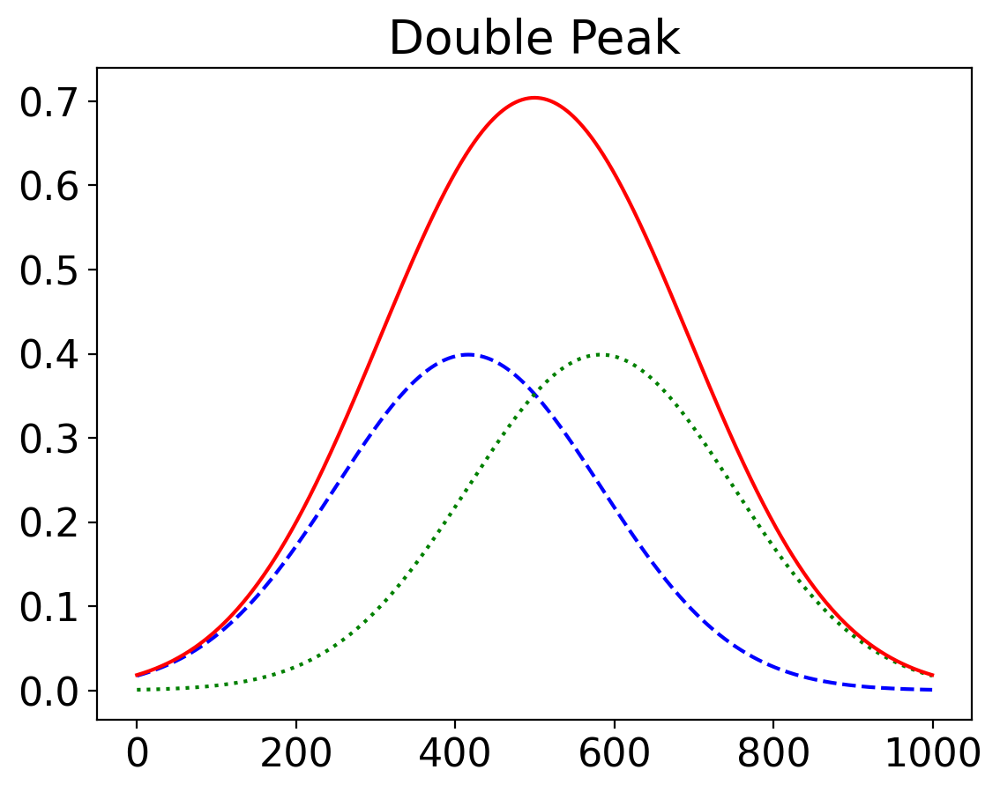
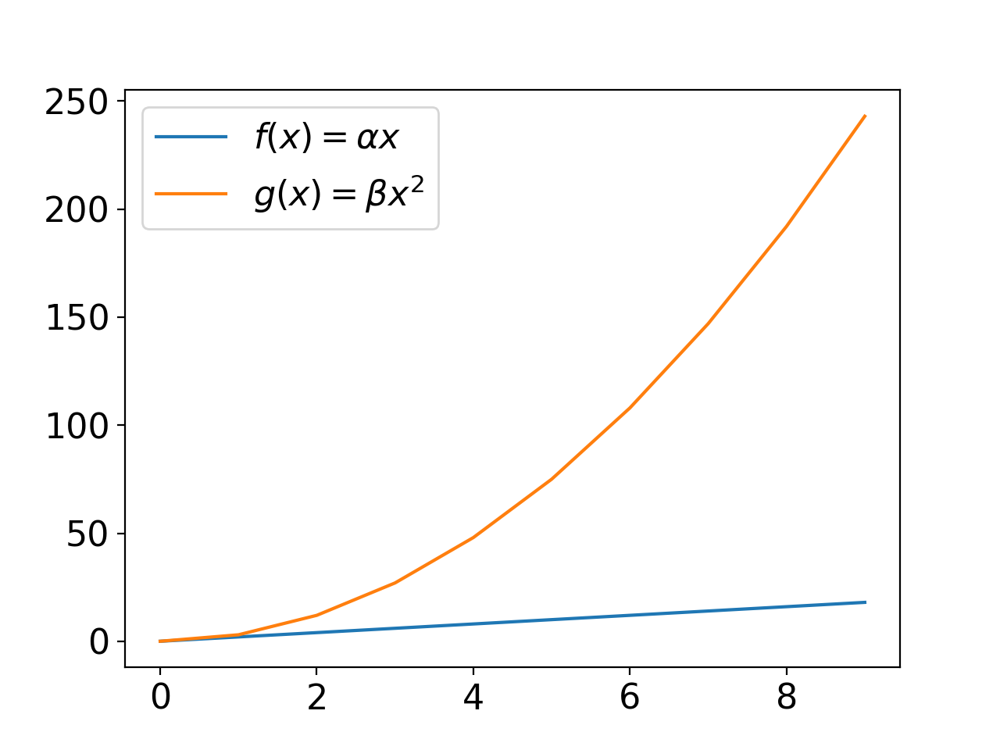

# Fine-Tuning Figures

We can place our data onto figures but it is necessary to make sure that our plot is labeled and readable to all people.

The default text size for Matplotlib is a bit on the small side and can produce hard to read plots when included in \\(\LaTeX\\) documents.
This can be changed to something more reasonable.
``` python
plt.rcParams.update({'font.size': 18}) # Adjust 18 to the size you need
```

### Labelling your Plots
A plot is useless without clear label with the associated physical units.
We can easily include these in our plots with some self-explanatory functions.
```python
t = np.linspace(0, 10, 100)
x = np.sin(t)

plt.plot(t, x)
plt.xlabel("Time [s]") # Adds label for x-axis
plt.ylabel("Position [m]") # Adds label for y-axis
plt.title("Position vs. Time") # Adds title
plt.show()
```


### Styling your Plots
One of the keys to presenting functional plots is to ensure that multiple pieces of information can be included in a single plot.
Using colour and patterns, we can start to optimise our figure space.
> **Note:** Remember to use both colour **and** different linestyles to provide clarity.
> You never know if your plots will be printed in black and white or if the reader experiences colour blindness.
``` python
import numpy as np

def gaussian_func(x, mean, std):
    # Evaluate a Gaussian of mu=mean and sigma=std at x 
	return (
        1 / np.sqrt(2 * np.pi * std ** 2) * np.exp(-((x - mean) ** 2) / (2 * std ** 2))
    )

x = np.linspace(-3, 3, 1000) 
lower_peak = gaussian_func(x, -0.5, 1)
upper_peak = gaussian_func(x, 0.5, 1)
combined = lower_peak + upper_peak

# The linestyle argument changes the way our lines look
# The color argument gives us flexibility in the choice of colour
# Remember to use readable colours for white background
plt.plot(lower_peak, linestyle="dashed", color="blue")
plt.plot(upper_peak, linestyle="dotted", color="green")
plt.plot(combined, color="red")
plt.title("Double Peak")
plt.show()
```



A complete list of [linestyles](https://matplotlib.org/gallery/lines_bars_and_markers/linestyles.html) and [colours](https://matplotlib.org/gallery/color/named_colors.html) can be found in the Matplotlib documentation.

### Adding Legends
Legends provide the clearest way of labelling different plots when they are included on the same figure.
Luckily, Matplotlib provides a simple automatic interface for making legends using `plt.legend()`.
``` python
import numpy as np

x = np.arange(0, 10)
alpha = 2
beta = 3

f = alpha * x
g = beta * x ** 2

# We use the label argument to give our plots names
plt.plot(x, f, label="Straight Line Plot")
plt.scatter(x, g, label="Scatter Plot")

# This command generates a legend using the labels of all the plots in the figure
plt.legend() 
plt.show()

# We can also label our plots with LaTeX expressions.
# Note the use of double \ instead of a single \ when writing commands
plt.plot(x, f, label="$f(x) = \\alpha x$")
plt.plot(x, g, label="$g(x) = \\beta x^{2}$")
plt.legend()
plt.show()
```



Full documentation can be found [online](https://matplotlib.org/api/_as_gen/matplotlib.pyplot.legend.html).
